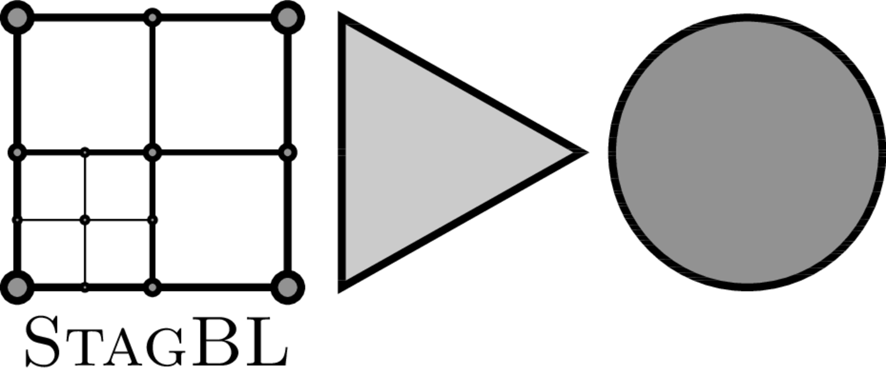

# StagBL

Development: See the Trello Board on the BitBucket repository.

During the experimental phase, we will maintain a list of self-contained experiments here:

* https://bitbucket.org/psanan/taras_ch7_toy : a minimal 2d Stokes solver, based on PETSc

## In this repository

`toys/` : relevant demonstrations/benchmarks/tests

`DMStag/` : a PETSc plugin DM 

`docs/` : documentation
