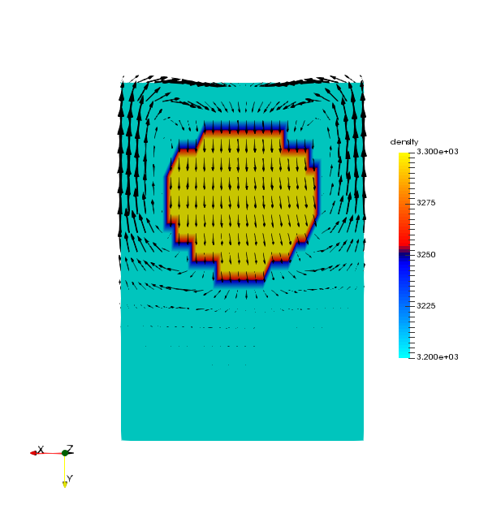

.. image:: documentation/resources/logo/logo_half.png
   :alt: StagBL

.. image:: https://travis-ci.com/stagbl/stagbl.svg?branch=master
    :target: https://travis-ci.com/stagbl/stagbl
    :alt: CI Status

About
-----

StagBL is a C library designed to allow optimized, massively-parallel
Stokes solvers for geodynamics application codes based on finite-volume
methods on regular, orthogonal grids, usually coupled to a
particle-based advection scheme.

It aims to be as lightweight as possible while still providing the
flexibility and extensibility required for scientific application codes.
This accomplished with careful design and interfaces to powerful
external libraries like `PETSc <https://www.mcs.anl.gov/petsc>`__.

Dependencies
------------

-  MPI
- `PETSc <https://www.mcs.anl.gov/petsc>`__
-  Python (for configuration only)

Quickstart
----------

Clone PETSc's master branch.

::

    git clone -b master https://bitbucket.org/petsc/petsc petsc-master

Configure PETSc with ``--download-suitesparse``, build, and check. See
`the PETSc
website <https://www.mcs.anl.gov/petsc/documentation/installation.html>`__
for more.

From this directory,

::

    export PETSC_DIR=yyy   # use value from your PETSc build
    export PETSC_ARCH=xxx  # use value from your PETSc build
    ./configure.py         # follow instructions to make
    cd demos/2d
    make
    ./stagbldemo2d -pc_type lu -pc_factor_mat_solver_type umfpack
    paraview out_element.vtr &

In parallel, if you have configured PETSc with MUMPS, also try

::

    $PETSC_DIR/$PETSC_ARCH/bin/mpiexec -np 4 ./stagbldemo2d -pc_type lu -pc_factor_mat_solver_type mumps -mat_mumps_icntl_23 100 -structure 2 -stag_grid_x 30 -stag_grid_y 50

.. image:: documentation/resources/stagbldemo2d_quickstart2.png
   :alt: stagbl2ddemo quickstart 2

Support
-------

Development of StagBL is supported by the `Platform for Advanced
Scientific Computing <https://www.pasc-ch.org>`__.
