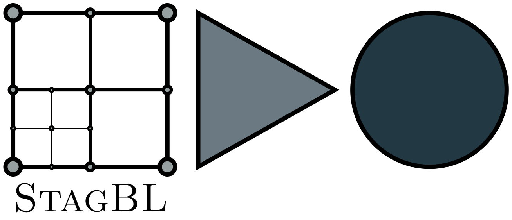
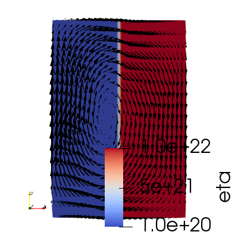
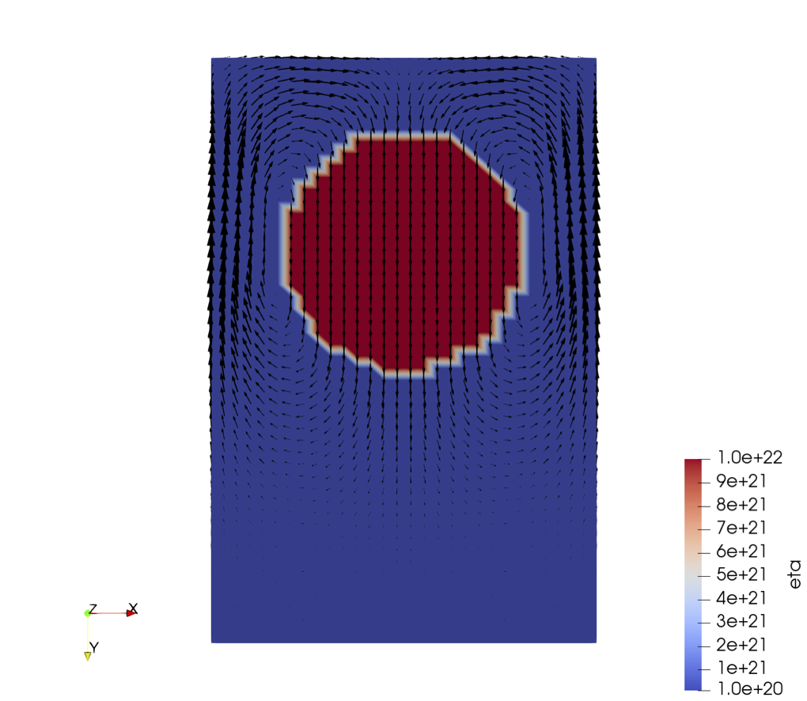

.. image:: https://travis-ci.com/stagbl/stagbl.svg?branch=master
    :target: https://travis-ci.com/stagbl/stagbl
    :alt: CI Status

.. image:: https://readthedocs.org/projects/stagbl/badge/?version=latest
    :target: https://stagbl.readthedocs.io/en/latest/?badge=latest
    :alt: Documentation Status

About
-----

StagBL is a C library designed to allow optimized, massively-parallel
Stokes solvers for geodynamics application codes based on finite-volume
methods on regular, orthogonal grids, usually coupled to a
particle-based advection scheme.

It aims to be as lightweight as possible while still providing the
flexibility and extensibility required for scientific application codes.
This accomplished with careful design and interfaces to powerful
external libraries. In particular, its parallel staggered-grid data structure
leverages the `DMStag component <https://www.mcs.anl.gov/petsc/petsc-current/docs/manualpages/DMSTAG/index.html>`__
within `PETSc <https://www.mcs.anl.gov/petsc>`__.

Development of StagBL is supported by the `Platform for Advanced
Scientific Computing <https://www.pasc-ch.org>`__.

Dependencies
------------

- `PETSc <https://www.mcs.anl.gov/petsc>`__
-  Python (for configuration)

Documentation
-------------
See `StagBL on Read the Docs <https://stagbl.rtfd.io>`__ for additional information.

Quickstart
----------

Clone a `custom branch <https://bitbucket.org/psanan/petsc/branch/psanan/stagbl-working-base>`__ of PETSc

.. code-block:: bash

    git clone -b master https://bitbucket.org/psanan/petsc -b psanan/stagbl-working-base petsc-stagbl

Configure PETSc with SuiteSparse (includes UMFPACK) and SuperLU_dist, build, and check. See
`the PETSc website <https://www.mcs.anl.gov/petsc/documentation/installation.html>`__
for full information. An example configuration command is:

.. code-block:: bash

    cd petsc-stagbl
    ./configure --download-mpich --with-debugging=0 --download-suitesparse --download-superlu_dist --download-metis --download-parmetis
    # Build and check as instructed
    cd ..

Note the values of ``PETSC_ARCH`` and ``PETSC_DIR`` defined during configuration.

Clone this repository, including submodules (using git 2.13 or later)

.. code-block:: bash

    git clone --recurse-submodules https://github.com/stagbl/stagbl

From the ``stagbl`` directory that is created,

.. code-block:: bash

    export PETSC_DIR=yyy   # use value noted above
    export PETSC_ARCH=xxx  # use value noted above
    ./configure.py         # follow instructions to make
    cd demos
    make 2d
    ./stagbldemo2d
    paraview out_element.vtr &

In parallel, try

.. code-block:: bash

    $PETSC_DIR/$PETSC_ARCH/bin/mpiexec -np 4 ./stagbldemo2d -mode sinker -stag_grid_x 30 -stag_grid_y 50
    paraview out_element.vtr &

