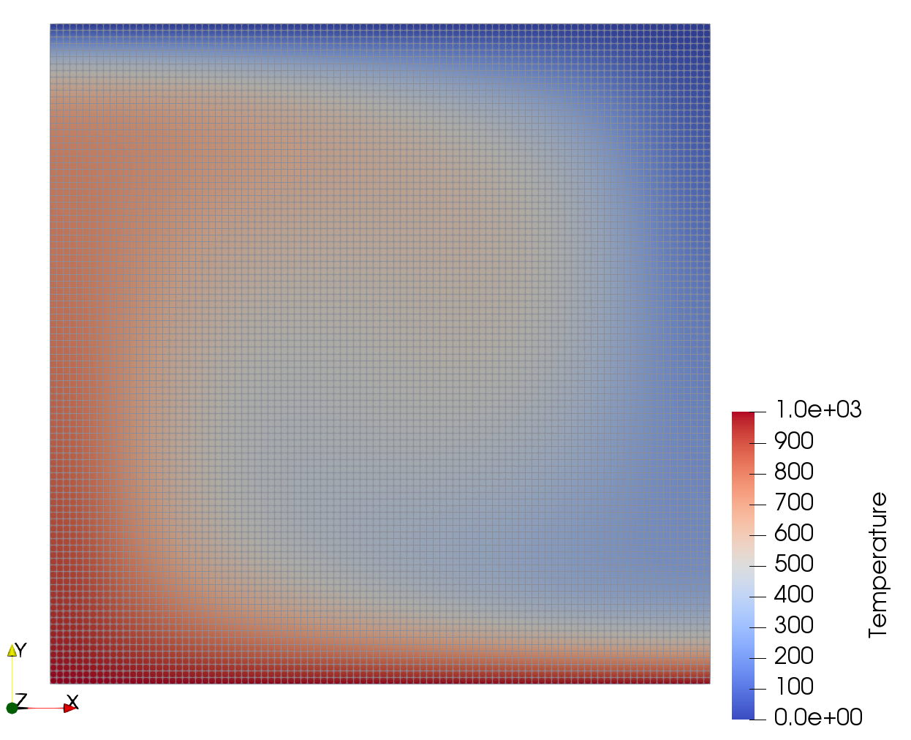

Benchmarks with StagBL
======================

The Blankenbach 1a Benchmark
----------------------------

`Blankenbach et al. <https://doi.org/10.1111/j.1365-246X.1989.tb05511.x>`__
describe several scenarios involving a simple model of a convection cell.

Case 1a is the simplest, a single convection cell using constant material properties,
modelled with the infinite Prandtl number Boussinesq equations.

Build and test StagBL as described in the quickstart in the `README <https://githbub.com/stagbl/stagbl>`__.
``PETSC_ARCH`` should be defined in your environment.

Set an environment variable to record the location of the StagBL build

.. code-block:: bash

    export STAGBL_DIR=$HOME/stagbl # change to the location of the stagbl repository that you cloned

Create a directory to work from, where various data will be output.

.. code-block:: bash

    mkdir working_directory
    cd working_directory

Run the benchmark

.. code-block:: bash

    $PETSC_DIR/$PETSC_ARCH/bin/mpiexec -np 4 $STAGBL_DIR/$PETSC_ARCH/bin/stagbldemo2d -mode blankenbach -stag_grid_x 100 -stag_grid_y 100 -nsteps 30

Examine the output to confirm that the Rayleigh number is 10000 and the Nusselt number approaches 4.88, as expected.

.. code-block:: none

    === StagBLDemo2d ===
    Mode: blankenbach
    Rayleigh number: 10000.
    Timestep 0, starts at t=0 (~0 Myr)
    Nusselt number: -5.68434e-17
    Timestep 1, starts at t=1e+16 (~317.058 Myr)
    Nusselt number: 4.75607
    Timestep 2, starts at t=2e+16 (~634.115 Myr)
    Nusselt number: 2.50053
    Timestep 3, starts at t=3e+16 (~951.173 Myr)
    [...]
    Timestep 28, starts at t=2.8e+17 (~8877.62 Myr)
    Nusselt number: 4.88285
    Timestep 29, starts at t=2.9e+17 (~9194.67 Myr)
    Nusselt number: 4.88285
    Timestep 30, starts at t=3e+17 (~9511.73 Myr)
    Nusselt number: 4.88285

Examine the flow field with Paraview to confirm it is as expected

.. code-block:: bash

    paraview out_temp_vertex_0030.vtr

Visualizing the "Temperature" field as "surface with edges":

