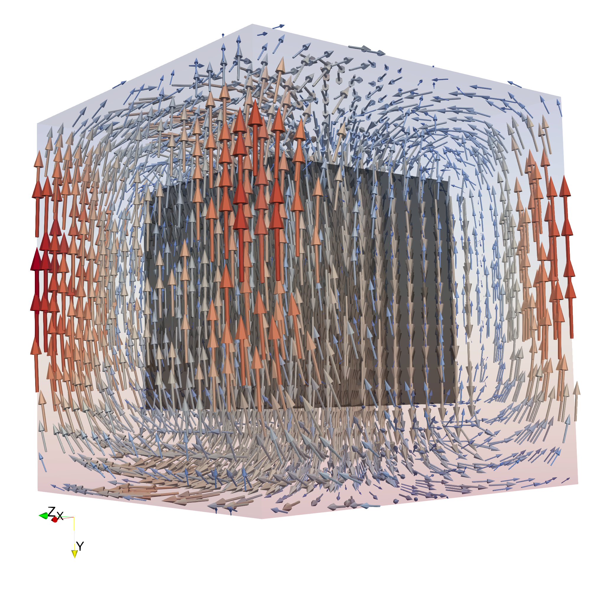
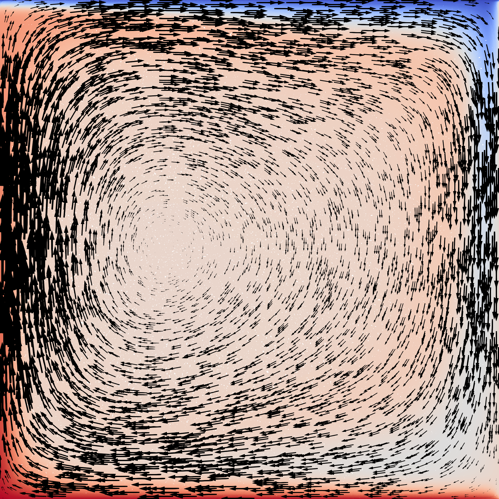
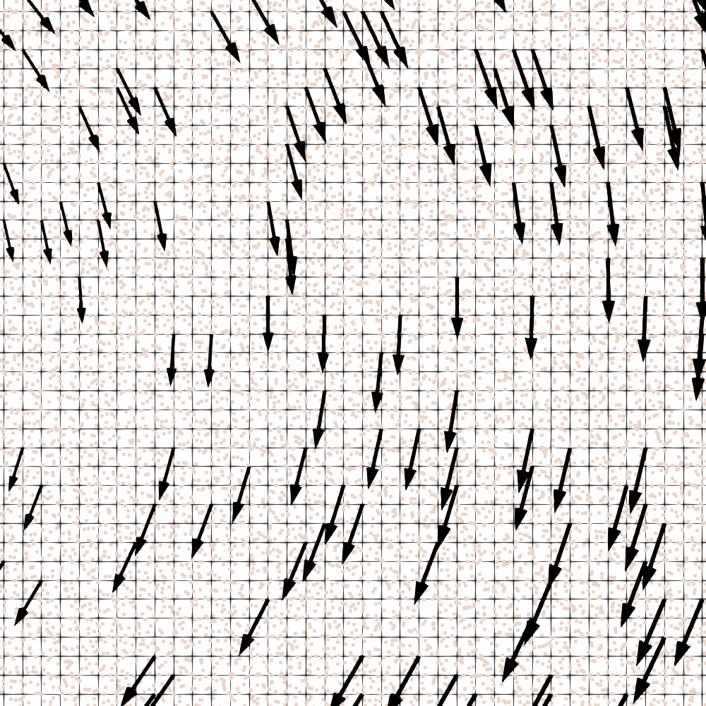

StagBL Demos
============

StagBLDemo2d and StagBLDemo3d are two mini-apps designed for several purposes:

1. To provide general examples of usage of StagBL. Whenever possible, these demos will be used
   as examples/tutorials.
2. "The path to performance," To demonstrate how programs similar to those in Gerya's textbook may be written with StagBL
3. To reproduce simple benchmarks with StagBL
4. To provide application testing for StagBL
5. To provide platforms for performance testing, particular for emerging architectures and HPC systems.

These codes are PETSc C codes, sharing some code between 2d and 3d demos, as
this allows for more concise demos, but StagBL can be called from any C/C++
application code, including those with their own MPI-based logic. (Usage from
Fortran is also possible with the use of some wrappers which are not currently
included with StagBL itself. Please contact the authors if this is of
interest.)

A 3D sinking block of higher viscosity and density, solved on a 20 by 20 by 20 element cube with StagBLDemo3D:

A 2D convection cell, using StagBLDemo2D to solve the infinite-Prandtl number Boussinesq equations. Uses a 512 by 519 element grid, on 9 MPI ranks in a 3 by 3 grid, for a 1000 timesteps.

.. code-block:: bash

    $PETSC_DIR/$PETSC_ARCH/bin/petscmpiexec -n 9 ./stagbldemo2d -mode blankenbach -nsteps 1000 -eta1 1e21 -stag_grid_x 511 -stag_grid_y 519 -stag_ranks_x 3 -stag_ranks_y 3

Close up of the image above, showing advected particles:

DMStag Demos
------------

In addition to these demos, there are several tutorial examples included with
PETSc, that demonstrate direct usage of DMStag, the object providing the main
implementation of the ``StagBLGrid`` object. See ``src/dm/impls/stag/tutorials``
in the PETSc source tree.

This object can be used for tasks beyond the scope of StagBL, as it provides
a generic interface for working with 1- to 3-dimensional, logically regular
cell complexes, in particular those corresponding to orthogonal grids.

For example, `DMStag tutorial ex6 (``src/dm/impls/stag/tutorials/ex6.c``) shows how to use DMStag to simulate seismic waves.

.. code-block:: bash

      rm -f *.vtr && ./ex6 -nsteps 1000 -stag_grid_x 1000 -stag_grid_y 1000 -dt 4e-4

The resulting `.vtr` file for frame 485 can be visualized in Paraview. This is the y velocity:

.. image:: resources/dmstag_ex6_yvel_485.png
